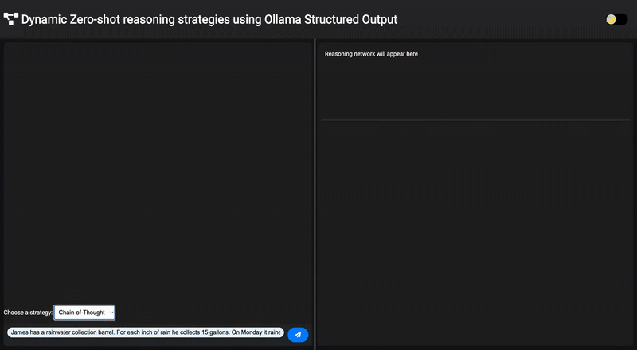

# Zero-Shot Reasoning with Ollama: Visualizing AI Thought Processes

This project offers a dynamic visualization of zero-shot reasoning strategies, powered by FastAPI and Ollama. It allows you to explore how AI models "think" when applying different reasoning approaches like Chain-of-Thought, Tree-of-Thought, and Graph-of-Thought, all through an interactive web interface.

## Video Demo



---

## Key Features

* **Dynamic Reasoning Strategies**: Seamlessly switch between **Chain-of-Thought (CoT)**, **Tree-of-Thought (ToT)**, and **Graph-of-Thought (GoT)** to observe varied AI reasoning patterns.
* **Interactive Visualizations**: Gain insights into the AI's thought process with real-time, interactive reasoning network graphs powered by `vis.js`.
* **Structured AI Outputs**: Leveraging **Ollama's structured output capabilities** (JSON schemas), responses are consistently formatted for clear analysis and visualization.
* **Robust FastAPI Backend**: A high-performance API handles interactions with the Ollama model, ensuring efficient reasoning execution.
* **Intuitive User Experience**: Includes a user-friendly web interface with a **light and dark theme toggle** for enhanced readability.

---

## Prerequisites

Before you begin, ensure you have the following installed:

* **Python 3.8+**
* **Ollama**: Installed and running (refer to the [Ollama website](https://ollama.com/) for installation instructions).
* **Git**

---

## Installation Guide

Follow these steps to get the application up and running:

1.  **Clone the Repository**

    ```bash
    git clone [https://github.com/safouaneelg/zeroshot-reasoning.git](https://github.com/safouaneelg/zeroshot-reasoning.git)
    cd zeroshot-reasoning
    ```

2.  **Set Up Your Python Environment**

    **Using Anaconda:**

    ```bash
    conda create --name zsreasoning python=3.10 ipykernel -y
    conda activate zsreasoning
    ```

    **Using `venv`:**

    ```bash
    python -m venv venv
    source venv/bin/activate  # On Windows: .\venv\Scripts\activate
    ```

3.  **Install Dependencies**

    ```bash
    pip install -r requirements.txt
    ```

4.  **Install and Pull Ollama Model**

    Make sure Ollama is installed and running. Then, pull the `gemma3:4b` model (or your preferred model):

    ```bash
    ollama pull gemma3:4b
    ```

---

## How to Use

1.  **Start the FastAPI Server**

    Open a first terminal in the `zeroshot-reasoning/` directory and run:

    ```bash
    python app.py
    ```

2.  **Serve the Frontend**

    Open a *new* terminal, navigate to the root of the `zeroshot-reasoning/` repository, and start a simple HTTP server:

    ```bash
    python -m http.server 8000
    ```

3.  **Access the Application**

    Open your web browser and go to <http://localhost:8000>.

    * **Select a strategy**: Choose between CoT, ToT, or GoT from the dropdown.
    * **Ask a question**: Type your technical question into the input field.
    * **Observe**: Watch as the AI processes your question, visualizes its reasoning network, and provides a structured answer.

---

## Project Structure

```plain
OllamaReasoner/
├── app.py              # FastAPI application
└── utils/
│   └── prompts.py      # Prompt templates and JSON schemas for reasoning strategies CoT, ToT, GoT
├── static/
│   └── index.css           # CSS styles for the frontend
├── index.html              # Main HTML file for the web interface
├── README.md               # Project documentation
├── requirements.txt        # Python dependencies
└── .gitignore              # Git ignore file
```

## Dependencies

See requirements.txt for a complete list. Key dependencies include:

- `fastapi` : For building the web API.
- `uvicorn` : An ASGI server for running FastAPI.
- `ollama` : Python client for interacting with Ollama.

## Common troubleshots

If the application runs but you encounter issues with response generation, it's often due to Ollama not serving the model. Ensure you have the Ollama server running in the background:

```bash
ollama serve
```

## License

This project is licensed under the MIT License. See the LICENSE file for details.

## Acknowledgments

Ollama for providing the LLM framework.
FastAPI for the API framework.
vis.js for network visualizations.
